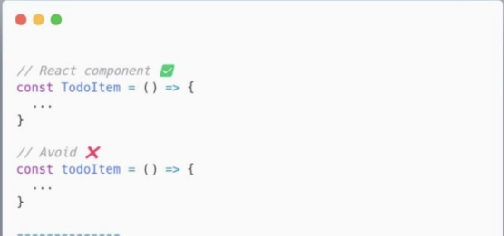
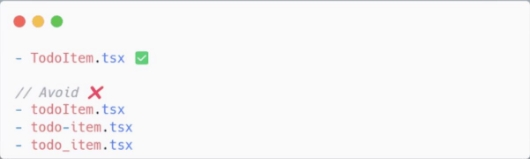
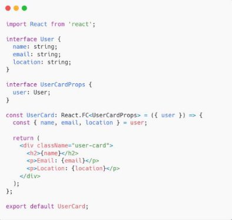
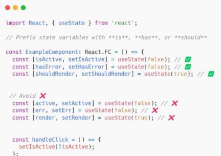
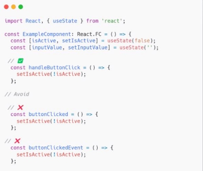
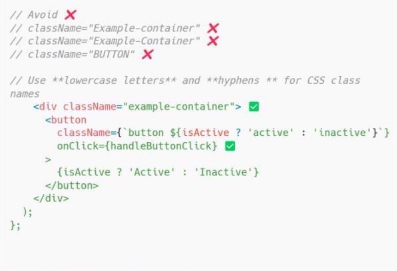
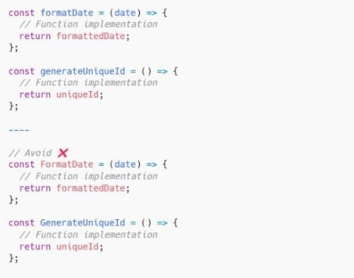

**NAMING CONVENTIONS**

By following the naming convention, the purpose and meaning of these

variables are clear, making the code more readable and maintainable.

1. Components

Use **PascalCase** (capitalizing the first letter of each word) for component names.

2. Files

Name your files using **PascalCase**, matching the component name. For example, if you have a component named UserCard, the file should be named UserCard.js.

3. Props

Use descriptive names for props to clearly indicate their purpose

4. State variables

Prefix state variables with **is, has,** or **should** to denote boolean values.

5. Event handlers

Use **handle** as a prefix for event handler functions. For example, handleClick, handleInputChange

6. CSS classes

Use **lowercase letters** and **hyphens** for CSS class names.

7. Constants

Use **uppercase letters with underscores** to represent constants in JavaScript.

8. Utility functions

Use camelCase for utility functions or helper functions

*Remember, the most important aspect of naming conventions is consistency within your project or team. It's also a good idea to document your naming conventions so that all team members can follow them consistently. !!*
