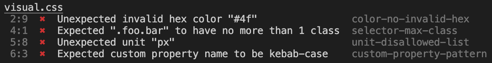

# Duckling Frontend Linters

## EsLint

ESLint is a tool for identifying and reporting on patterns found in ECMAScript/JavaScript code, with the goal of making code more consistent and avoiding bugs.

ESLint is completely pluggable. Every single rule is a plugin and you can add more at runtime. You can also add community plugins, configurations, and parsers to extend the functionality of ESLint.

[Getting Started with ESLint](https://eslint.org/docs/latest/use/getting-started)
## Prettier Lint

[What is Prettier?](https://prettier.io/docs/en/why-prettier)

[Why Prettier?](https://prettier.io/docs/en/why-prettier)
## Style Lint

A mighty CSS linter that helps you avoid errors and enforce conventions.

### Features

It's mighty as it:

- has over **100 built-in rules** for modern CSS syntax and features
- supports **plugins** so you can create your own custom rules
- automatically **fixes problems** where possible
- supports **shareable configs** that you can create or extend
- can **be customized** to your exact needs
- has **15k unit tests** making it robust
- is **trusted by companies worldwide** like Google and GitHub

And it can be extended to:

- extract **embedded styles** from HTML, Markdown and CSS-in-JS template literals
- parse **CSS-like languages** like SCSS, Sass, Less and SugarSS

### How it'll help you

It'll help you **avoid errors**, for example:

- invalid things, e.g. malformed grid areas
- valid things that are problematic, e.g. duplicate selectors
- unknown things, e.g. misspelled property names

And **enforce conventions**, for example:

- disallow things, e.g. specific units
- enforce naming patterns, e.g. for custom properties
- set limits, e.g. the number of ID selectors
- specify notations, e.g. for modern color functions

We recommend using a pretty printer like Prettier alongside Stylelint. Linters and pretty printers are complementary tools that work together to help you write consistent and error-free code.

### Example output

<p align="center">
  
</p>


## Commit Lint

<p align="center">
  
</p>

### What is commitlint

commitlint checks if your commit messages meet the [conventional commit format](https://conventionalcommits.org).

In general the pattern mostly looks like this:

```sh
type(scope?): subject  #scope is optional; multiple scopes are supported (current delimiter options: "/", "\" and ",")
```

Real world examples can look like this:

```
chore: run tests on travis ci
```

```
fix(server): send cors headers
```

```
feat(blog): add comment section
```

Common types according to [commitlint-config-conventional (based on the Angular convention)](https://github.com/conventional-changelog/commitlint/tree/master/@commitlint/config-conventional#type-enum) can be:

- build
- chore
- ci
- docs
- feat
- fix
- perf
- refactor
- revert
- style
- test

These can be modified by [your own configuration](#config).

### Benefits using commitlint

- [Why Use Conventional Commits?](https://www.conventionalcommits.org/en/v1.0.0-beta.2/#why-use-conventional-commits)
- ["The perks of committing with conventions" (Talk slides)](https://slides.com/marionebl/the-perks-of-committing-with-conventions#/)

## Husky

<p>Husky improves your commits and more 🐶 <em>woof!</em></p>
<p>You can use it to <strong>lint your commit messages</strong>, <strong>run tests</strong>, <strong>lint code</strong>, etc... when you commit or push. Husky supports <a href="https://git-scm.com/docs/githooks" target="_blank" rel="noreferrer">all Git hooks</a>.</p>
<p>Click <a href="/husky/getting-started.html">here</a> to get started.</p>

## Lint-Staged
Run linters against staged git files and don't let :poop: slip into your code base!

```bash
npm install --save-dev lint-staged # requires further setup
```

```
$ git commit

✔ Preparing lint-staged...
❯ Running tasks for staged files...
  ❯ packages/frontend/.lintstagedrc.json — 1 file
    ↓ *.js — no files [SKIPPED]
    ❯ *.{json,md} — 1 file
      ⠹ prettier --write
  ↓ packages/backend/.lintstagedrc.json — 2 files
    ❯ *.js — 2 files
      ⠼ eslint --fix
    ↓ *.{json,md} — no files [SKIPPED]
◼ Applying modifications from tasks...
◼ Cleaning up temporary files...
```

## Why

Linting makes more sense when run before committing your code. By doing so you can ensure no errors go into the repository and enforce code style. But running a lint process on a whole project is slow, and linting results can be irrelevant. Ultimately you only want to lint files that will be committed.

This project contains a script that will run arbitrary shell tasks with a list of staged files as an argument, filtered by a specified glob pattern.


## Referrences

https://eslint.org/docs/latest/use/getting-started

https://prettier.io/docs/en/install

https://github.com/primer/stylelint-configs

https://stylelint.io/user-guide/get-started

https://www.npmjs.com/package/husky

https://www.npmjs.com/package/lint-staged

https://github.com/conventional-changelog/commitlint
